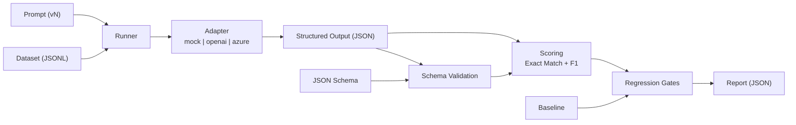

# AI Evaluation Harness (Production‑Minded, Minimal)

[](https://github.com/marckarbowiak/ai-evaluation-harness/actions/workflows/ci.yml)

A lightweight evaluation harness for LLM features that produce **structured JSON outputs**.

It provides:

- Schema validation
- Regression scoring (Exact Match + F1)
- Deterministic mock adapter for CI
- OpenAI / Azure OpenAI support
- Quality gates (threshold-based failure)
- Baseline regression protection

The goal is simple: **treat AI features like production software** — measurable, testable, and safe to evolve.

---

## Why This Exists

LLM-powered features regress easily when:

- prompts change
- models are upgraded
- decoding parameters change
- schemas evolve
- retrieval / RAG logic changes

This harness ensures changes are:

- measurable
- reproducible
- enforceable in CI

---

# Architecture Overview



---

# Repository Structure

```
ai-evaluation-harness/
  .github/workflows/ci.yml
  baselines/
  datasets/
  prompts/
  reports/
  schemas/
  src/eval_harness/
  tests/
  run.ps1
  test.ps1
```

---

# Quickstart (Windows / PowerShell)

This repository includes helper scripts to ensure a consistent local setup.

## Run the harness (mock adapter)

From repo root:

```powershell
.\run.ps1
```

This will:

- Create `.venv` if missing
- Activate it
- Install dependencies
- Run the evaluation harness

---

# run.ps1 Options

| Parameter | Default | Description |
|------------|----------|-------------|
| `-Adapter` | `mock` | `mock`, `openai`, `azure` |
| `-Dataset` | `datasets\sample_tasks.jsonl` | JSONL evaluation dataset |
| `-Prompt` | `prompts\task_extraction\v1.md` | Prompt file |
| `-Schema` | `schemas\task_extraction.schema.json` | JSON schema file |
| `-MinSchemaValidRate` | `1.0` | Fail if below threshold |
| `-MinAvgF1` | `0.8` | Fail if below threshold |
| `-Baseline` | `baselines\task_extraction.mock.baseline.json` | Baseline reference |
| `-MaxAvgF1Drop` | `0.02` | Allowed regression delta |
| `-WriteBaseline` | switch | Write current summary as baseline |

---

# Baselines

## What is a baseline?

A baseline is a **committed reference summary** representing known-good evaluation performance.

It prevents silent degradation.

Example:

If baseline avg F1 = 0.92

And a change drops it to 0.83

Even if minimum threshold is 0.80 — this is still a regression.

Baseline regression catches this.

---

## Creating or Updating the Baseline

Explicitly run:

```powershell
.\run.ps1 -WriteBaseline
```

This writes:

```
baselines/task_extraction.mock.baseline.json
```

Commit it.

Baselines are **never updated automatically**.

---

## When to Update the Baseline

Update only when:

- Prompt improvements intentionally change output
- Model upgrades are accepted
- Dataset changes are deliberate

Do NOT update baseline to “make CI green.”

Treat baseline updates like snapshot test updates — deliberate and reviewed.

---

# Python Virtual Environment (.venv)

## What is it?

A Python virtual environment is an **isolated Python runtime per project**.

It ensures:

- No global dependency pollution
- Reproducible installs
- Alignment with CI

The environment lives in:

```
.venv/
```

It is not committed to Git.

---

## Activating manually

```powershell
.\.venv\Scripts\Activate.ps1
```

Deactivate:

```powershell
deactivate
```

---

## Optional PowerShell helpers

Add to your `$PROFILE`:

```powershell
function venv {
    if (!(Test-Path ".\pyproject.toml")) {
        Write-Host "Not repo root" -ForegroundColor Yellow
        return
    }
    if (!(Test-Path ".\.venv\Scripts\Activate.ps1")) {
        python -m venv .venv
    }
    . .\.venv\Scripts\Activate.ps1
}

function devenv {
    if (Get-Command deactivate -ErrorAction SilentlyContinue) {
        deactivate
    }
}
```

Usage:

```powershell
cd ai-evaluation-harness
venv
```

---

## Do I need to activate manually?

No.

Both `run.ps1` and `test.ps1` automatically create and activate `.venv`.

Manual activation is only needed for interactive debugging.

---

# Testing

Run tests via:

```powershell
.\test.ps1
```

This ensures:

- `.venv` exists
- pytest is installed
- tests run via `python -m pytest`

---

# CI Behavior

CI runs:

- Unit tests
- Mock adapter quality gate
- Baseline regression check (if baseline committed)
- Optional Azure gate if secrets are configured

Reports are uploaded as artifacts.

---

# Example Report Output

Below is a simplified example of a generated report file (`reports/run-abc123.json`):

```json
{
  "summary": {
    "total": 12,
    "schema_valid_rate": 1.0,
    "exact_match_rate": 0.42,
    "avg_f1": 0.78,
    "avg_latency_ms": 12.4,
    "total_cost_usd": 0.00
  },
  "cases": [
    {
      "id": "case-001",
      "schema_valid": true,
      "exact_match": false,
      "f1": 0.83,
      "latency_ms": 9,
      "cost_usd": 0.0
    },
    {
      "id": "case-002",
      "schema_valid": true,
      "exact_match": true,
      "f1": 1.0,
      "latency_ms": 8,
      "cost_usd": 0.0
    }
  ]
}
```

The `summary` section is what quality gates and baseline regression checks compare against.

- `schema_valid_rate` ensures structured output correctness.
- `exact_match_rate` is strict equality vs expected output.
- `avg_f1` allows partial credit scoring.
- `avg_latency_ms` enables performance tracking.
- `total_cost_usd` enables future cost gating.

These metrics make LLM behavior measurable and enforceable in CI.

---

# Extending This Harness

Recommended next steps (intentionally not over-engineered):

- Per-tag thresholds (edge-case vs happy-path)
- Cost tracking gates
- Prompt A/B comparison
- Per-case regression diff reporting

Keep it small, measurable, and production-aligned.

---

# Philosophy

This harness favors:

- Determinism in CI
- Explicit baselines
- Controlled regression
- Clear failure modes

AI systems drift.

Production systems measure that drift.

